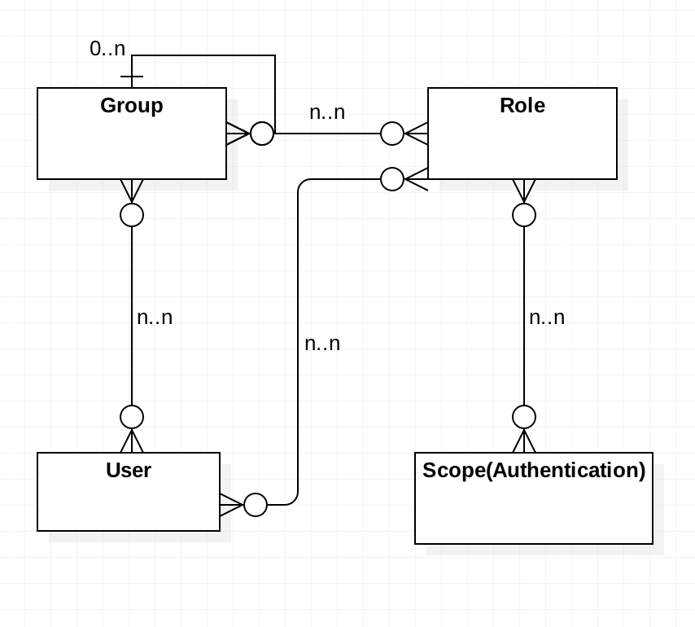

# 用户管理设计

## 1. 基本概念

1. 用户

用户是系统的操作者。
一个用户可以属于1到N个组，1到N个不同的角色。

2. 角色

对许多拥有相同权限的用户的定义，例如管理员，用户。

3. 组

组是组（子组）与用户的集合，一个组可以拥有多个组以及直属于这个组的员工。
每个子组只能属于一个组。
每个组拥有N个角色，N个用户，可以指定1到N个负责人。

它们之间的关系如下图：

## 2. 初始化操作

1. 系统初始化

在开发者完成注册后，系统会创建一个基础组，指定负责人为该开发者，以及最小访问权限角色。
同时创建管理员角色，该角色拥有系统最大权限，与开发者关联。

2. 组初始化

所有的组都需要有上层组（最顶层是基础组，由系统初始化）。
在组创建的过程，需要创建该组对应的角色。

3. 用户注册

用户必须注册在一个组下（若没有，则注册在基础组）。

## 3. 基本操作

1. 用户管理

用户拥有对自身操作的所有权限（增删改查）。

新注册的用户，归属于基础组。

用户加入某个组，有以下几种模式：

* 无限制
* 用户自己申请，需要该组负责人同意
* 组负责人加某用户，需要该用户同意
* 组负责人加某用户，直接加该用户，不需要用户同意

用户退出某个组，有以下几种模式：

* 无限制
* 需要该组管理员或上级管理员同意

2. 角色与权限管理

角色与权限的管理，由系统管理员操作。

3. 组管理

组的管理，由系统管理员操作。

